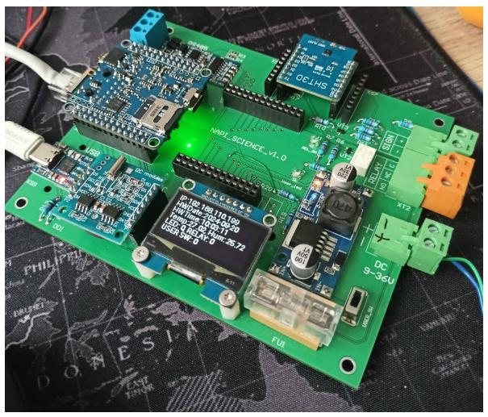
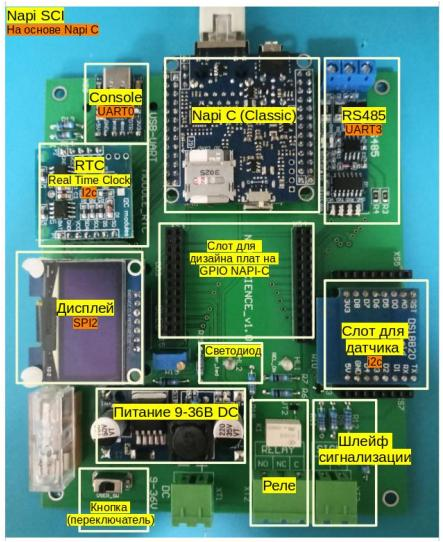

# Napi Sci

## Плата для тестов и обучения Linux




## Блоки платы



## Готовые прошивки

Прошивку на основе NapiLinux с настроенными драйверами и скриптами можно скачать 

## Демо-скрипты

- napi_sci_hw.py - небольшая библиотека для чтения\записи GPIO b RTC
- SSD1306.py - библиотека для дисплея Napi Sci
- napi_display_demo.py - скрипт, опрашивает датчик, RTC, GPIO и выводит информацию на дисплей.

Необходимые библиотеки:

- smbus2  `pip3 install smbus2`


### Дисплей

Дисплей подключен на интерфейс SPI2. Для его функционирования необходимо подключить оверлей `rk3308-spi2-spidev` и убрать оверлеи для uart1, uart2.

Скрипт, выводящий на дисплей
- IP адрес
- Время и дату с RTC
- Значение датчика SHT30
- Состояние реле и переключателя 


### Цифровые датчики i2c и часы RTC 

Датчики и часы функционируют на шине i2c1. Отдельный оверлей для датчиков подключать не нужно, для часов необходимо подключить `rk3308-i2c1-ds3231`

- Прочитать время из RTC

```
root@napi-rk3308b-s:~# hwclock -r
2024-09-20 11:22:48.492633+00:00
root@napi-rk3308b-s:~# 
```
- Записать в RTC время из системы 

```
root@napi-rk3308b-s:~# hwclock -w
root@napi-rk3308b-s:~# 

```

### Светодиод и Реле

Светодиод `user_led` подключен на `GPIO0_C0`(чип 0, номер 16(C)+0)
- Включить: `gpioset -t 0 -c gpiochip0 16=1`
- Выключить: `gpioset -t 0 -c gpiochip0 16=0`
- Прочитать статус: `gpioget -a  -c gpiochip0 16` 

Реле подключено на `GPIO2_B6` (чип 2, номер 8(B)+6)
- Включить: `gpioset -t 0 -c gpiochip2 14=1`
- Выключить: `gpioset -t 0 -c gpiochip2 14=0`
- Прочитать статус: `gpioget -a  -c gpiochip2 14` 

Статус реле задублирован на светодиод `rel_on`

### Переключатель

Переключатель `user_sw` подключен на `GPIO0_B7`
- Прочитать статус: `gpioget -a -c gpiochip0 15`

 

### Файл оверлеев

Так должен выглядеть файл оверлеев

/etc/boot/uEnv.txt

```
verbosity=7
fdtfile=rk3308-rock-pi-s.dtb
console=ttyS0,115200n8
overlays=rk3308-spi2-spidev rk3308-uart3 rk3308-i2c1-ds3231 rk3308-usb-pcie-modem rk3308-usb20-host
kernelimg=Image
extraargs=

```


